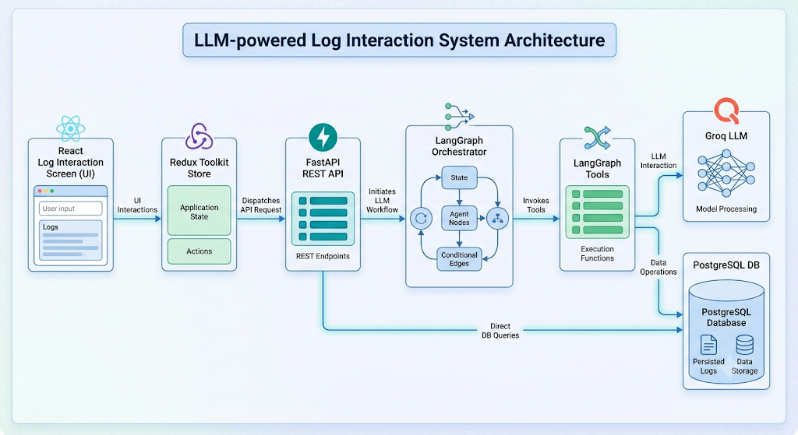
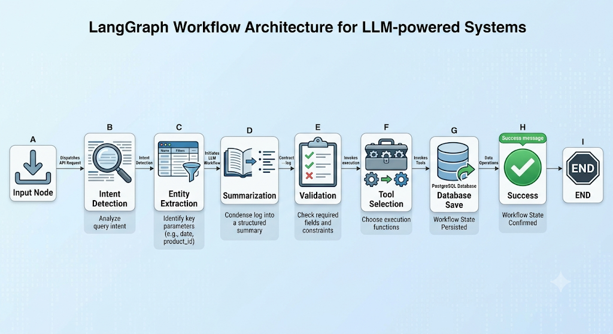
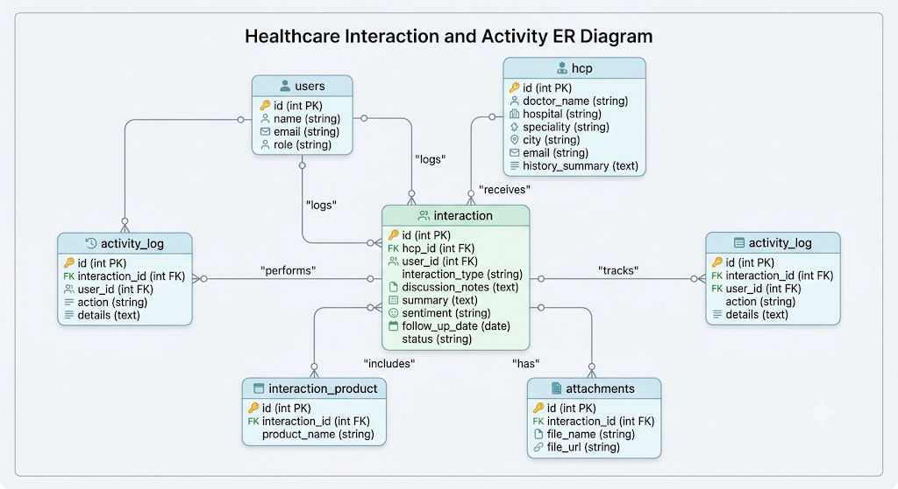
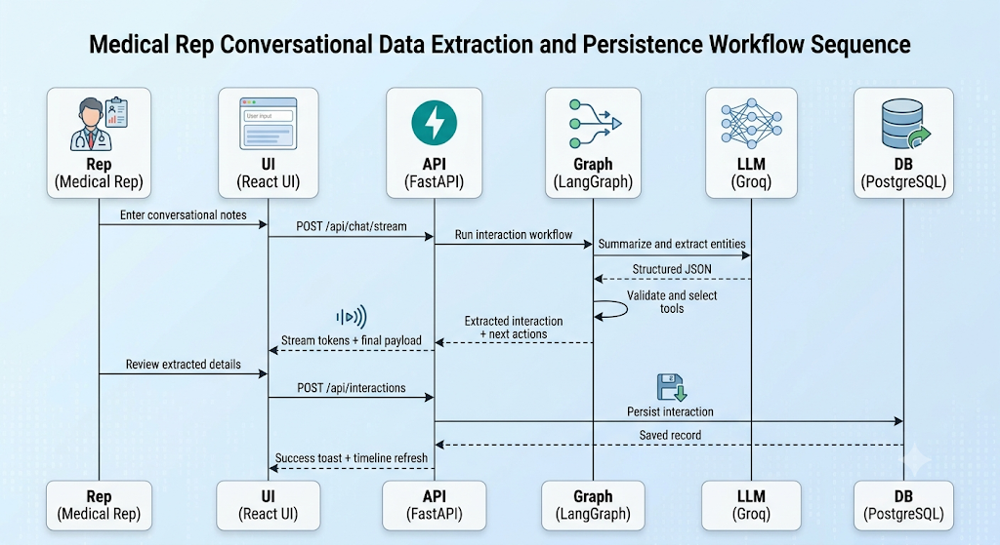

# AI-First CRM HCP Module

Production-ready Life Sciences CRM module for Medical Representatives to log Healthcare Professional (HCP) interactions through both a structured form and a conversational AI assistant.

## Highlights

- Built a responsive frontend using React, TypeScript, Redux Toolkit, Tailwind CSS, and React Hook Form.
- Developed a FastAPI backend with SQLAlchemy, Pydantic, and PostgreSQL.
- Implemented LangGraph to orchestrate AI workflows, including intent detection, entity extraction, validation, and interaction logging.
- Integrated Groq LLM (`gemma2-9b-it`) with support for switching to `llama-3.3-70b-versatile`.
- Created AI tools for logging interactions, editing interactions, searching HCPs, suggesting next best actions, and generating follow-up emails.
- Designed a clean, modular, and scalable project structure with Docker support.
- Added user-friendly features such as voice-to-text interaction, auto-save drafts, streaming AI responses, Markdown chat support, dark mode, and toast notifications.

---

## Project Structure

```text
AI-CRM-HCP/
├── frontend/
│   └── src/
│       ├── components/
│       ├── pages/
│       ├── store/
│       ├── services/
│       ├── hooks/
│       ├── types/
│       └── App.tsx
├── backend/
│   ├── app/
│   │   ├── agents/
│   │   ├── graphs/
│   │   ├── tools/
│   │   ├── api/
│   │   ├── database/
│   │   ├── models/
│   │   ├── schemas/
│   │   ├── services/
│   │   └── core/
│   ├── main.py
│   ├── requirements.txt
│   └── Dockerfile
├── docker-compose.yml
├── .env.example
└── README.md
```

---

## Architecture Diagram



---

## LangGraph Workflow



---

## ER Diagram



---

## Sequence Diagram



---

## demo
https://github.com/ankita99-ui/AI-CRM-HCP/blob/main/assets/ai_crm_demo(1).gif

---

## Complete Project Explanation

This module is designed as an AI-first CRM interaction logging surface for field medical teams. The frontend provides a single high-value screen where reps can either complete a validated structured form or speak naturally to an AI assistant. Redux stores auth, HCP search state, interaction drafts, chat history, and UI preferences such as dark mode and toasts.

The backend follows clean architecture boundaries:

- `api/` handles transport and request validation
- `schemas/` defines Pydantic contracts
- `services/` contains business logic
- `models/` defines SQLAlchemy entities
- `graphs/` and `agents/` orchestrate AI workflows
- `tools/` expose reusable LangGraph-capable actions

When a chat message arrives, LangGraph routes the conversation through intent detection, entity extraction, summarization, validation, tool selection, optional database save, and success response generation. If no Groq API key is configured, the system still works using deterministic fallback extraction so local development and demos remain functional.

---

## Conclusion

Building the AI-CRM-HCP project helped demonstrate how AI can simplify the daily workflow of medical representatives. Instead of manually filling out lengthy forms, users can simply describe their conversation with a healthcare professional, and the AI automatically extracts the important details, generates a summary, and logs the interaction.

By combining React, FastAPI, LangGraph, Groq LLM, and PostgreSQL, the application delivers a smooth and intelligent user experience while keeping the architecture modular and scalable. The project also highlights how AI agents can automate repetitive CRM tasks, improve data accuracy, and save valuable time for field teams.

Overall, this project is a step toward building smarter CRM solutions for the healthcare industry, with the flexibility to add future features such as voice input, multilingual support, calendar integration, and advanced analytics.

---

## Future Improvements

- Role-based authentication and audit trails
- File upload service for real attachment storage
- CRM integration with Salesforce/Veeva
- Multi-turn memory and conversation persistence
- Offline-first mobile PWA for field reps
- Human-in-the-loop approval before auto-save
- Analytics dashboard for territory managers
- Fine-tuned extraction for brand-specific product catalogs

---

## References

1. Eric Matthes, *Python Crash Course* (3rd Edition), No Starch Press, 2023.
2. Luciano Ramalho, *Fluent Python* (2nd Edition), O'Reilly Media, 2022.
3. Mark Lutz, *Learning Python* (5th Edition), O'Reilly Media, 2013.
4. Antonio Melé, *Django 5 By Example*, Packt Publishing, 2024.
5. Alex Martelli, Anna Ravenscroft, Steve Holden, *Python in a Nutshell* (4th Edition), O'Reilly Media, 2023.
6. FastAPI Documentation. Available at: https://fastapi.tiangolo.com/
7. LangGraph Documentation. Available at: https://langchain-ai.github.io/langgraph/
8. LangChain Documentation. Available at: https://python.langchain.com/docs/
9. Groq API Documentation. Available at: https://console.groq.com/docs
10. React Documentation. Available at: https://react.dev/
11. Redux Toolkit Documentation. Available at: https://redux-toolkit.js.org/
12. PostgreSQL Documentation. Available at: https://www.postgresql.org/docs/
